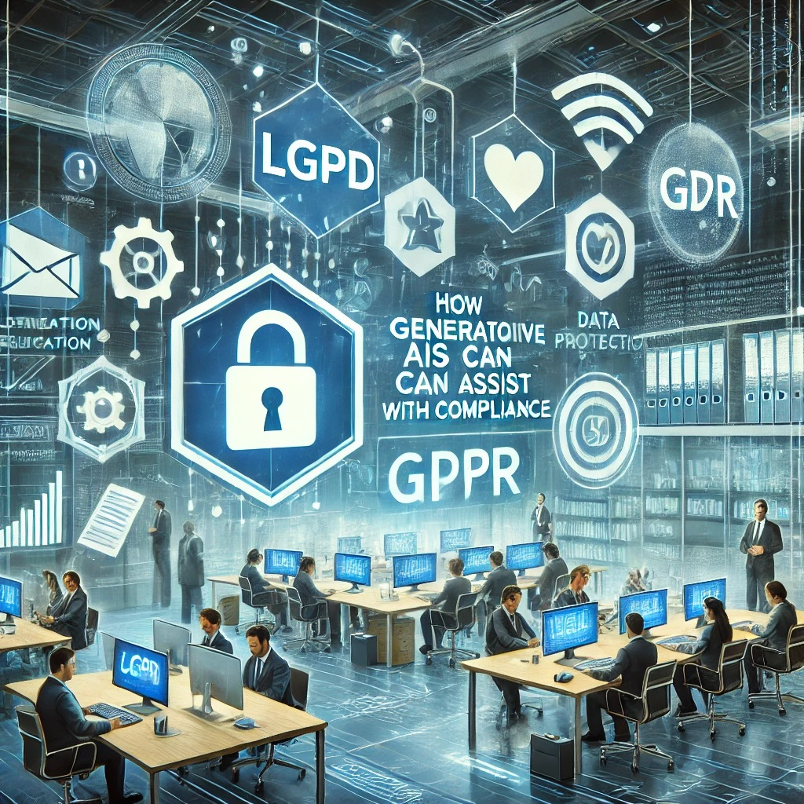

# Compliance e IAs Generativas: Uma Abordagem Prática

## 📒 Descrição
Este projeto explora como as IAs generativas podem ser usadas para auxiliar em temas relacionados à **Compliance**, com foco em otimizar processos, criar conteúdos educativos e apoiar a implementação de regulamentações, como a **LGPD** (Lei Geral de Proteção de Dados) e **GDPR** (General Data Protection Regulation).

## 🤖 Tecnologias Utilizadas
- **ChatGPT (OpenAI)**: Geração de textos explicativos e educativos.
- **Bing Chat (Microsoft)**: Geração de textos explicativos e educativos.
- **Bard (Google)**: Geração de textos explicativos e educativos.
- **DALL·E (OpenAI)**: Criação de representações visuais para ilustrar conceitos de compliance.
- **ElevenLabs**: Geração de narração para podcasts educativos.
- **Synthesia**: Criação de vídeos com avatares virtuais para explicações de compliance.
- **GitHub**: Hospedagem do projeto e documentação.

## 🧐 Processo de Criação
1. **Planejamento**: Definição do escopo do projeto, com foco em compliance corporativo.
2. **Desenvolvimento**:
   - Uso do ChatGPT para criar conteúdos relacionados a boas práticas de compliance.
   - Aplicação do DALL·E para gerar gráficos e imagens que reforçam os conceitos apresentados.
   - Produção de podcasts educativos com ElevenLabs.
   - Criação de vídeos explicativos usando avatares virtuais com Synthesia.
3. **Documentação**: Estruturação da documentação em Markdown, organizada de forma didática e acessível.

## 🚀 Resultados
- Documentação clara e objetiva sobre compliance, criada com auxílio de IA.
    - Foi utilizado os textos gerados pelo ChatGPT porque os textos estavam mais completos e consisos.
- Exemplos visuais para ilustrar casos práticos, como fluxos de tratamento de dados pessoais.
- Podcasts e vídeos educativos para disseminar boas práticas de conformidade.
- Sugestões para a implementação de um plano de conformidade utilizando ferramentas digitais.

## 💭 Reflexão (Opcional)
Este projeto mostrou como as IAs generativas podem ser aliadas em temas complexos como compliance, proporcionando insights rápidos e permitindo a personalização de conteúdos. Apesar das limitações das IAs, como a necessidade de validação humana, a experiência demonstrou o potencial de integrar tecnologia e regulamentações de forma inovadora.

### Exemplos e Insights

- [E-BOOK](/exemplos/E-BOOK.md)
- [Podcast](/exemplos/PODCAST.md)
- [Vídeo (Avatar Virtual)](/exemplos/VIDEO.md)

## Links Interessantes

- [CNIL: Guia de conformidade para LGPD](https://www.cnil.fr/en/gdpr-guide)
- [International Association of Privacy Professionals (IAPP)](https://iapp.org/)
- [Data Protection Commission: Resumos de regulamentação](https://www.dataprotection.ie/)
- [Compliance com Inteligência Artificial: Tendências e Desafios](https://www.complianceweek.com/)

